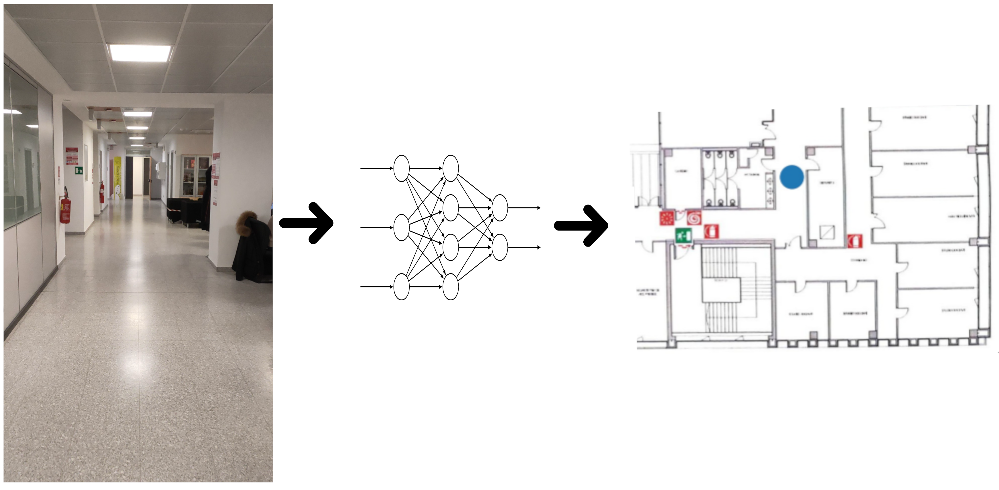
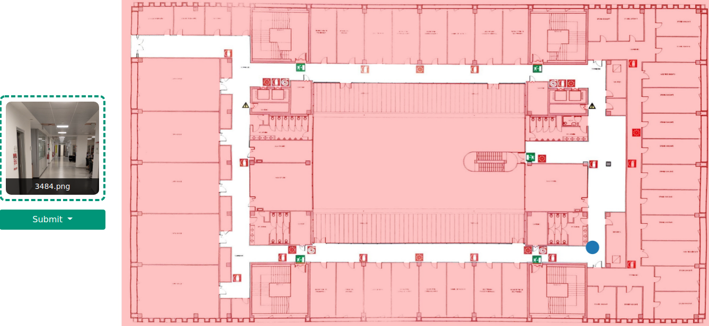

# A Deep Learning Approach to Camera Pose Estimation
The task of __camera pose estimation__ aims to find the position of the camera that captured an image within a given environment.
While different geometric approaches have already been studied in the literature, the aim of this project is to analyze and improve the performances of deep learning models for the camera pose estimation problem.
In this work, we analyze models for both relative camera pose estimation (MeNet) and absolute camera pose estimation [PoseNet](#posenet), [MapNet](#mapnet).
Moreover, we propose a pipeline for the generation of a ground truth dataset based on structure from motion techniques (COLMAP).
Finally, we:
1. show how the proposed framework has been used to build a dataset of the second floor of the Povo 1 building in the University of Trento,
2. train an absolute pose estimation deep learning model with PyTorch, and
3. deploy it through a web dashboard using FastAPI.



The project [report](./docs/report/main.pdf) with some additional implementation details is available in the [docs folder](./docs/).

## How to use
The steps required to use this repo are:

1. use [video to dataset](#video-to-dataset) procedure on a video to generate a labeled dataset;
2. use [absolute or relative](#cross-validation-split) procedure to split dataset in train, validation and test;
3. create a train config file for absolute or relative model according to next sections (if absolute split was made an absolute model should be used, same for relative);
3. create a test config file for absolute or relative model according to next sections (if absolute train was made an absolute test should be used, same for relative);
4. create an inference config for the dataset: all steps to align CRSs and scale dataset must be done by hand. The procedure used for Povo 1 Second floor can be found in [notebooks folder](./notebooks);
5. launch the dashboard to deploy the model. At the moment the dashboard will serve the cadastral plan of Povo 1 Second floor. Some changes in the code are required for a different dataset.

## Absolute pose estimation models
Currently available absolute pose estimation models are:

- PoseNet
- MapNet

### PoseNet
In order to run the PoseNet it is required to create two config files. For each of the two, a sample has been provided:
- [train](./camera-pose-estimation/model/posenet_train.ini.sample) configuration file;
- [test](./camera-pose-estimation/model/posenet_test.ini.sample) configuration file.

To launch the training procedure:
```bash
python ./camera-pose-estimation/model/run.py --config ./camera-pose-estimation/model/posenet_train.ini --train
```

To launch the testing procedure:
```bash
python ./camera-pose-estimation/model/run.py --config ./camera-pose-estimation/model/posenet_test.ini --test
```

#### Config docs
*Train config*
```toml
[environment]
# experiment and run name used for tracking losses and model weights
# an experiment is defined as a collection of runs
experiment_name = "posenet"
run_name = "resnet152_weighted_custom_2"
seed = 0
epochs = 50

[model]
name = "posenet"
# value that can be adjust based on the representation used
# for the orientation. In this case 3 for pose and 4 for quaternion
outputs = 7

[dataloader]
# save preprocessed dataset according to data folder structure.
# This reduces the dataset loading time on each run
save_processed_dataset = true
num_workers = 4
batch_size = 128

[loss]
# available losses: mse, L1Loss, SmoothL1Loss, weighted
type = "L1Loss"
# weights used only with weighted loss
weights = [1, 1, 1, 1, 1, 1, 1]

[optimizer]
name = "SGD"
lr = 0.1
momentum = 0.9

[scheduler]
name = "StepLR"
step_size = 20
gamma = 0.1

[paths]
# datasets can be a csv file (in this case it is computed a slow preprocessing)
# or a folder in which a preprocessed dataset is saved (faster loading)
# example:
#    train_dataset = "/path/to/train.csv"
# or
#    train_dataset = "/path/to/data/my_dataset/processed_dataset/train"
train_dataset = "path"
validation_dataset = "path"
test_dataset = "path"
# images, net_weights_dir and aim_dir are directories
images = "path"
net_weights_dir = "path"
aim_dir = "path"
```

*Test config*
```toml
[environment]
# experiment and run names used during the training phase
experiment_name = "posenet"
run_name = "resnet152"

[dataloader]
# save preprocessed dataset according to data folder structure.
# This reduces the dataset loading time on each run
save_processed_dataset = true

[paths]
# datasets can be a csv file (in this case it is computed a slow preprocessing)
# or a folder in which a preprocessed dataset is saved (faster loading)
# example:
#    test_dataset = "/path/to/test.csv"
# or
#    test_dataset = "/path/to/data/my_dataset/processed_dataset/test"
test_dataset = "path"
# targets and predictions are csv files where targets and predictions is saved
targets = "path"
predictions = "path"
# images and net_weights_dir are directories
images = "path"
net_weights_dir = "path"
```

### MapNet
In order to run PoseNet it is required to create a config files:
- [train](./camera-pose-estimation/model/mapnet_train.ini.sample) configuration file;
- [test](./camera-pose-estimation/model/mapnet_test.ini.sample) configuration file.

*Train*
```bash
python ./camera-pose-estimation/model/run.py --config ./camera-pose-estimation/model/mapnet_train.ini --train
```

*Test*
```bash
python ./camera-pose-estimation/model/run.py --config ./camera-pose-estimation/model/mapnet_test.ini --test
```

#### Config docs
*Train config*
```toml
[environment]
# name of the experiment for net weights dir and aim
experiment_name = "posenet"
# name of the run for net weights dir and aim
run_name = "resnet152_weighted_custom_2"
seed = 0
epochs = 50

[model]
name = "mapnet"
feature_dimension = 2048
dropout_rate = 0.5

[dataloader]
num_workers = 4
batch_size = 64
# value used for torchvision jitter transform
color_jitter = 0.5
# defines how many frames are ingested by the relative pose criterion
step = 5
# defines the distance between two frames ingested by the relative pose criterion
skip = 5
# save preprocessed dataset according to data folder structure.
# This reduces the dataset loading time on each run
save_processed_dataset = true

# required only with 7scenes dataset
# sequences = {"train": "seq-02", "validation": "seq-03"}

[loss]
# parameters of the custom mapnet criterion, please refer to the
# full documentation pdf file in docs folder
type = "mapnet_criterion"
beta = 0
gamma = 0
learn_beta = false
learn_gamma = false

[optimizer]
name = "SGD"
lr = 0.05
momentum = 0.9

[scheduler]
name = "StepLR"
step_size = 60
gamma = 0.5

[paths]
# datasets can be a csv file (in this case it is computed a slow preprocessing)
# or a folder in which a preprocessed dataset is saved (faster loading)
# example:
#    test_dataset = "/path/to/test.csv"
# or
#    test_dataset = "/path/to/data/my_dataset/processed_dataset/test"
train_dataset = "path"
validation_dataset = "path"
test_dataset = "path"
# images, net_weights_dir and aim_dir are directories
net_weights_dir = "path"
aim_dir = "path"
images = "path"
```

*Test config*
```toml
[environment]
# experiment and run names used during the training phase
experiment_name = "posenet"
run_name = "resnet152"

[dataloader]
# save preprocessed dataset according to data folder structure.
# This reduces the dataset loading time on each run
save_processed_dataset = true

[paths]
# datasets can be a csv file (in this case it is computed a slow preprocessing)
# or a folder in which a preprocessed dataset is saved (faster loading)
# example:
#    test_dataset = "/path/to/test.csv"
# or
#    test_dataset = "/path/to/data/my_dataset/processed_dataset/test"
test_dataset = "path"
# targets and predictions are csv files where targets and predictions is saved
targets = "path"
predictions = "path"
# images and net_weights_dir are directories
images = "path"
net_weights_dir = "path"
```

## Relative pose estimation models
Currently available relative pose estimation models are:

- MeNet

### MeNet
In order to run PoseNet it is required to create a config files:
- [train](./camera-pose-estimation/model/menet_train.ini.sample)
- [test](./camera-pose-estimation/model/menet_test.ini.sample)

*Train*
```bash
python ./camera-pose-estimation/model/run.py --config ./camera-pose-estimation/model/menet_train.ini --train
```

*Test*
```bash
python ./camera-pose-estimation/model/run.py --config ./camera-pose-estimation/model/menet_test.ini --test
```
#### Config docs
*Train*
Same of PoseNet.

*Test*
Same of PoseNet.

## Inference
The inference procedure can be used to make the model compute predictions. This mode is particularly useful for deploying the model in the web-server.

This configuration sample contains many hard-coded constants that have been computed for Povo 1 Second floor dataset.
Note that it is required to compute them for every new dataset: unfortunately there is no automatic script to do it yet.
For calculating these constants on new datasets, you can refer to the [CRS alignment notebook](./notebooks/crs_alignment.ipynb).

```toml
[environment]
# experiment and run names used during the training phase
# in this way the script will load the train config file
experiment_name = "name"
run_name = "name"

[image_processing]
# unit measure for the scaling factor in the dataset CRS.
unit_measure = 4.22608635945641
# pixels_amount is the unit measure for the scaling factor in the real world CRS.
# Since the map of an environment is an image, it is useful to express coordinates also in pixel
pixels_amount = 630
# rotation_matrix and translation_vector required for the rigid tranform that
# allows to align the dataset crs with the real world crs.
rotation_matrix = [
    [ 0.09043424,  0.21994528, -0.97131134],
    [-0.99584784,  0.00975923, -0.09050882],
    [-0.01042773,  0.97546339,  0.2199146 ]]
translation_vector = [
    [1080.31885417],
    [ 652.52917988],
    [  -1.84188703]]

[paths]
# net_weights_dir is a directorie
net_weights_dir = "path"
```

## Dataset
Datasets are created using [COLMAP](https://colmap.github.io/), which is a tool that allows to build a 3D point cloud reconstruction model of an environment by using photos of it. During the reconstruction process, it also computes camera poses in an arbitrary reference system.

Even if the positions computed by COLMAP are well accurate most of the time, the process is very demanding in terms of time and resources.

### Video to dataset
The script [video to dataset](./camera-pose-estimation/tools/video_to_dataset.sh) takes a video and splits it into multiple images that are used to compute a sparse or dense model using COLMAP. Once the reconstruction is done, the script extract poses of the cameras.
```bash
usage: video_to_dataset.sh [-h] -v VIDEO -o OUTPUT_PATH [-f FRAMES] [-c CAMERA_REFENCE_PATH]
                           [-n NUM_THREADS] [-q {low,medium,high,extreme}] [-t {sparse,dense}]

Convert video to a dataset

optional arguments:
  -h, --help            show this help message and exit
  -v VIDEO, --video VIDEO
                        Path to the video
  -o OUTPUT_PATH, --output_path OUTPUT_PATH
                        Output path where images are saved
  -f FRAMES, --frames FRAMES
                        Number of frames to extract
  -c CAMERA_REFENCE_PATH, --camera_refence_path CAMERA_REFENCE_PATH
                        Path where camera db values is saved
  -n NUM_THREADS, --num_threads NUM_THREADS
                        Number of threads to use (default all threads)
  -q {low,medium,high,extreme}, --quality {low,medium,high,extreme}
                        Quality of colmap reconstruction
  -t {sparse,dense}, --type {sparse,dense}
```

### Cross validation split
Scripts [split absolute dataset](./camera-pose-estimation/tools/split_absolute_dataset.sh) and [split relative dataset](./camera-pose-estimation/tools/split_relative_dataset.sh) split dataset into train, validation and test files given a folder created with the video to dataset script.

```bash
usage: split_absolute_dataset.sh [-h] -i INPUT_PATH [-n] [-t TRAIN_SPLIT] [-v VALIDATION_SPLIT]
                                 [-e TEST_SPLIT]

Convert video to a dataset

optional arguments:
  -h, --help            show this help message and exit
  -i INPUT_PATH, --input_path INPUT_PATH
                        Input path where images and models are saved
  -n, --no_normalization
                        Block normalization process
  -t TRAIN_SPLIT, --train_split TRAIN_SPLIT
                        Number of samples for train phase
  -v VALIDATION_SPLIT, --validation_split VALIDATION_SPLIT
                        Number of samples for validation phase
  -e TEST_SPLIT, --test_split TEST_SPLIT
                        Number of samples for test phase
```

### Data folder structure
Given a video, the final folder specified by `OUTPUT_PATH` should present the following structure:
```bash
 .
├──  imgs
│  ├──  0000.png
│  ├──  ........
│  └──  XXXX.png
├──  processed_dataset
│  ├──  test
│  │  ├──  dataset_X.pt
│  │  └──  dataset_Y.pt
│  ├──  train
│  │  ├──  dataset_X.pt
│  │  └──  dataset_Y.pt
│  └──  validation
│     ├──  dataset_X.pt
│     └──  dataset_Y.pt
├──  workspace
│  ├──  sparse
│  │  └──  0
│  │     ├──  cameras.bin
│  │     ├──  images.bin
│  │     ├──  points3D.bin
│  │     └──  project.ini
│  └──  database.db
├──  points3D.csv
├──  positions.csv
├──  test.csv
├──  train.csv
└──  validation.csv
```
Where:
- `imgs` folder contains all frames;
- `processed_dataset` folder contains the dataset processed with the absolute pose dataset (these are actually generated during the first training and testing procedure: see model section for more information);
- `workspace/` contains cloud point models created by COLMAP;
- `points3D.csv` contains all features extracted by COLMAP;
- `positions.csv` contains all camera poses extracted by COLMAP;
- `train.csv`, `validation.csv` and `test.csv` are files created with the split scripts.

## Dashboard
The dashboard is built with `FastAPI`, and it allows users to interact with the final model through a web-based *Bootstrap* dashboard. The dashboard can show the model predictions in three different ways:

* raw model output displayed through an alert;
* raw model output shown in the floor map;
* post-processed model output in a walkable zone in the floor map.



*Launch the web-server and dashboard*
```bash
cd camera-pose-estimation/model
uvicorn webserver:app
```
